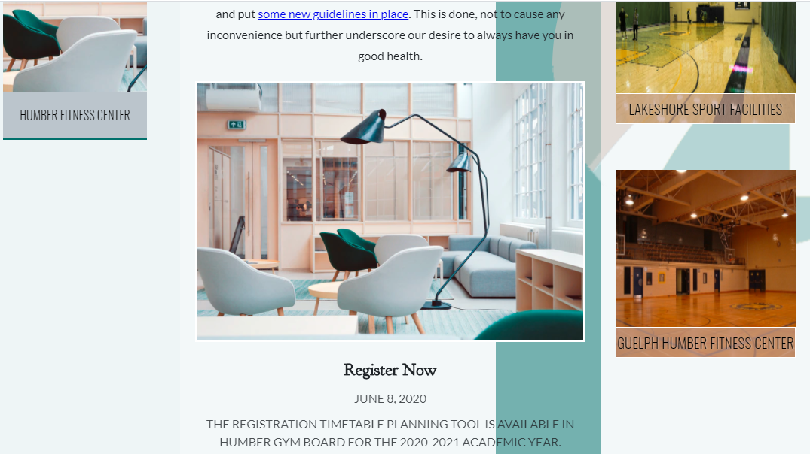

# WDDM-120-psd-html-layout: IBIYEMI KAYODE
**CONVERT A PSD DESIGN TO SOURCE CODE**

Link: https://kode-sektor.github.io/wddm-120-psd-html-layout/

---

## Overview

This is a small project that converts a Photoshop-designed layout to an actual web design; reinforcing web concepts like typography, colour combination and the implementation of the CSS grid system.
